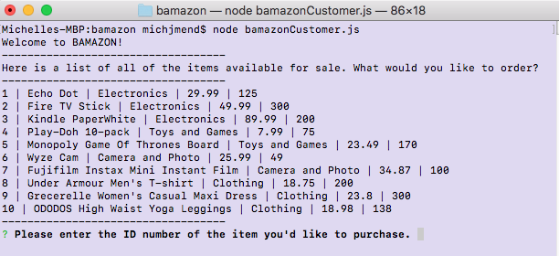
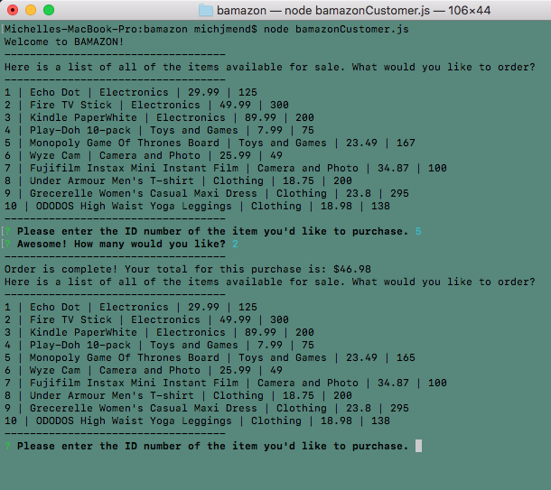
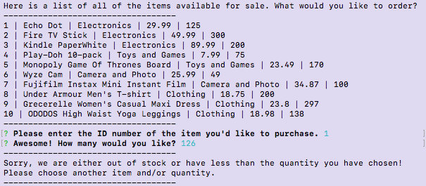

# BAMAZON :credit_card: :handbag:
Author: Michelle Mendieta

## Here is a MySQL Database called bamazon!

### These are the steps to launch the application:
1. There is a products table that comes up when you run the command line: **node bamazonCustomer.js**
   
2. Answer the two prompts that come up
   1. ID number of the item
   2. Quantity of said item
   
3. After the questions are answered, you will get 1/2 responses:
   1. Order is placed (as shown above) with new stock quantity calculated
      1. In the above example it shows ID# 9 Grecerelle Women's Casual Maxi Dress going from a quantity of 300 to 297 after purchasing 3 of them.
   2. Insufficient Quantity
   

**Place another order and have fun!!** :smile:
